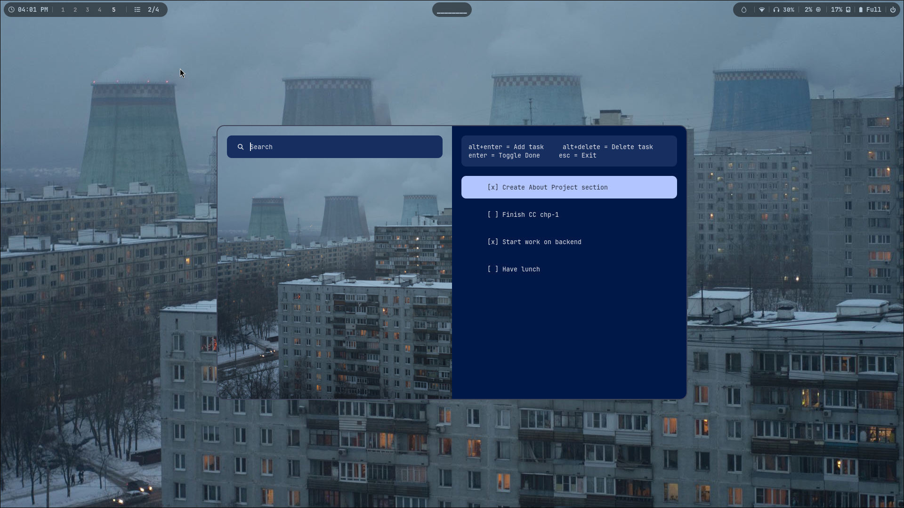

# waybar-tasksys

A minimal, keyboard-driven task manager integrated with **Waybar** and **Rofi**.

[](tasksys_showcase.mp4)

---

## Features
- Native Rofi-based interface
- Seamless Waybar module support
- Full keyboard control
  - **Enter** → Toggle task done/undone  
  - **Alt+Enter** → Add task  
  - **Shift+Enter** → Delete task  
  - **Esc** → Exit

---

## Requirements
- Python 3.8+
- Rofi installed and acceessible in $PATH

---

## Installation

**Directly through cloning the Repository**

```bash
git clone https://github.com/joshdagla/waybar-tasksys.git
cd waybar-tasksys
chmod +x tasksys.py 
sudo cp tasksys.py /usr/local/bin/waybar-tasksys
```
---

## Waybar Integratiom

Add this to your Waybar config:
```json
"custom/tasksys": {
    "exec": "waybar-tasksys",
    "return-type": "json",
    "on-click": "waybar-tasksys --popup",
    "interval": 5,
    "format": "  {} ",
    "tooltip": true,
    "max-length": 20,
}
```

Add this to your Waybar CSS(You can customize style however you want:
```css
#custom-tasksys {
    background-color: rgba(17, 17, 17, 0.85);
    border-radius: 12px;
    padding: 4px 10px;
    margin: 2px;
    font-weight: 500;
    color: #d8dee9;
}

#custom-tasksys.tasksyson {
    color: #a3be8c;
}

#custom-tasksys.tasksysoff {
    color: #5e81ac;
}
```
